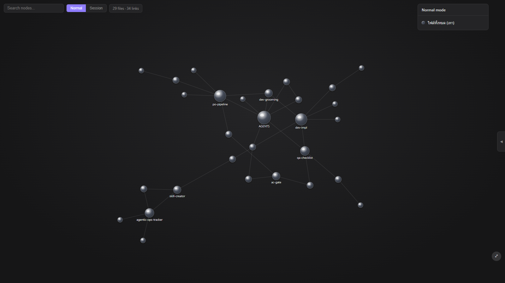
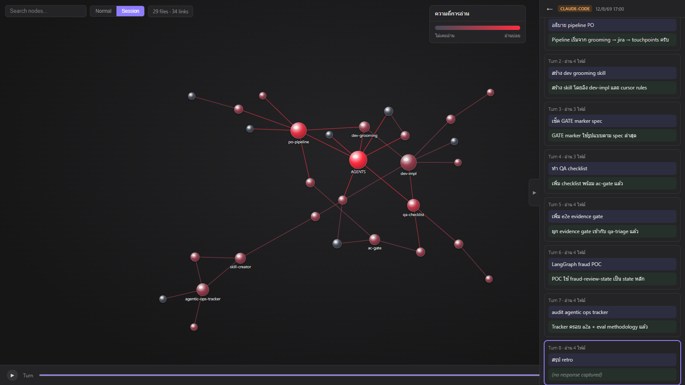

# FileTraceViz

เครื่องมือ debug สำหรับ agentic coding workflow ที่ใช้ LLM wiki/vault (ไฟล์ `.md` ที่ link กันแบบ Obsidian) เป็นแหล่ง context — ตอบคำถามว่า **"แต่ละ prompt ใน session นั้น agent ไปอ่านไฟล์ไหนใน vault บ้าง?"** ด้วยกราฟแบบ Obsidian graph view ที่ node ไล่สีจากเทา → แดงเข้มตามความถี่ที่ไฟล์ถูกอ่านสะสม

| Normal mode | Session mode (replay + heat) |
|---|---|
|  |  |

**หลักการทำงาน (log-first, ไม่มี server รันตลอด):**

```
Hook (Cursor/Claude Code) → เขียน JSONL ลง ~/.filetraceviz/logs/ ตรงๆ
                                        ↓ (จบ session แล้วค่อยเปิดดู)
Vault (.md) + session-*.jsonl → เปิดใน browser → เลือก 2 folder → replay กราฟ
```

ไม่ realtime (เป็น replay ย้อนหลัง), ไม่มี process ใดๆ รันระหว่างใช้ Cursor/Claude Code — hook เขียนไฟล์อย่างเดียว

## Quick start

### 0. สิ่งที่ต้องมี

- **Chrome หรือ Edge** (ใช้ CSS `@property` + File System Access API)
- **Git Bash** (มากับ Git for Windows อยู่แล้ว) + **jq** (`winget install jqlang.jq`)
- Node ≥ 20 สำหรับเปิด viewer

### 1. ติด hook — Claude Code

copy เนื้อหา [hooks/claude-code/settings.json](hooks/claude-code/settings.json) เข้า `.claude/settings.json` ของโปรเจคที่ต้องการ trace (หรือ merge ส่วน `hooks` ถ้ามี settings เดิมอยู่แล้ว) แล้วแก้ path ให้ชี้ไปที่ hook scripts ในโปรเจคนี้ — hook ทั้ง 3 ตัวคือ:

| Event | Script | เก็บอะไร |
|---|---|---|
| `UserPromptSubmit` | `log-prompt.sh` | prompt เต็ม + นับ turn |
| `PreToolUse` (matcher `Read`) | `log-file-read.sh` | ทุกไฟล์ที่ agent อ่าน (รวม subagent — มี `agent_id`) |
| `Stop` | `log-response.sh` | คำตอบสุดท้ายของ agent จาก transcript |

เปิด session ใหม่ (hook โหลดตอนเริ่ม session) แล้ว log จะไปอยู่ที่ `~/.filetraceviz/logs/session-<id>.jsonl`

### 2. ติด hook — Cursor

copy [hooks/cursor/hooks.json](hooks/cursor/hooks.json) เข้า `~/.cursor/hooks.json` (หรือ `.cursor/hooks.json` ของโปรเจค) แล้วแก้ path ให้ชี้ script จริง

> **ข้อจำกัดฝั่ง Cursor:** hook ของ Cursor ไม่มีจังหวะที่เข้าถึงข้อความตอบของ agent ได้ → session ของ Cursor จะมีแค่ `user_prompt` + `read` (panel แสดง "(not available on Cursor)") — โครงสร้าง hooks ของ Cursor เปลี่ยนบ่อย ตรวจชื่อ event กับเอกสารเวอร์ชันที่ใช้ด้วย

### 3. เปิดดู

```bash
npm install && npm run build   # ครั้งแรกครั้งเดียว
npx filetraceviz               # หรือ node bin/filetraceviz.js
```

เปิด browser ให้อัตโนมัติ → เลือก **vault folder** (.md) + **log folder** (`~/.filetraceviz/logs`) → เปิดกราฟ

- server ตัวนี้รันเฉพาะตอนเปิดดู (ไม่ขัดหลัก log-first — ข้อห้ามคือ server ที่ต้องรันระหว่างใช้ editor)
- ยังไม่มี log? ลอง `http://localhost:4173/?demo=1` ดูด้วย mock data ได้เลย

## การใช้งาน

- **Normal mode** — ทุก node เทา: ดูโครงสร้าง vault เฉยๆ
- **Session mode** — เลือก session จาก panel ฝั่งขวา (list = วันเวลา + editor + prompt แรก) → node ไล่สีเทา→แดงตาม **จำนวน turn ที่ไฟล์ถูกอ่านสะสมถึง turn ที่เลือก** (cap ที่ 4 ครั้ง = แดงเข้มสุด; อ่านซ้ำใน turn เดียวนับ 1)
- ปุ่ม **play** ไล่ turn อัตโนมัติ — panel จะ highlight คู่ prompt/response ของ turn นั้นพร้อมกัน, คลิก turn ใน panel เพื่อกระโดด, คลิกข้อความเพื่ออ่านเต็ม
- **↻ reload** อ่าน log folder ซ้ำ (มี session ใหม่เพิ่มระหว่างเปิดอยู่)
- **⚠ badge** มุมบนซ้าย = warnings จาก parser (ลิงก์เสีย, ไฟล์ใน log ที่ไม่อยู่ใน vault) — คลิกดูรายการ

## ⚠️ Privacy

**log เก็บ prompt และ response เต็มความยาว ไม่ตัดทอน** — ไฟล์ใน `~/.filetraceviz/logs/` คือบทสนทนาทั้ง session ของคุณ:

- **ห้าม commit ไฟล์ log ลง git** (`.gitignore` ของโปรเจคนี้กันไว้แล้ว — โปรเจคอื่นต้องเพิ่มเอง)
- คิดก่อนแชร์ไฟล์ log ให้คนอื่น

## ข้อจำกัดที่รู้

- ไม่ realtime — by design (replay หลังจบ session)
- 1 turn = 1 คู่ prompt→response นับจาก `UserPromptSubmit`; turn ที่ user กด interrupt จะไม่มี `agent_response`
- Browser: Chrome/Edge เท่านั้น
- Performance: physics วัดแล้วรับได้ถึง ~3,000 ไฟล์ (steady tick ~15ms) แต่ SVG rendering (per-node drop-shadow) ยังไม่ได้วัดกับ vault ใหญ่จริง — vault ระดับพันไฟล์ขึ้นไปอาจหน่วง ถ้าเจอให้เปิด issue พร้อมขนาด vault
- ไฟล์ใน log ที่ไม่มีใน vault แสดงเป็นตัวเลข unmatched ใน panel + warning (ยังไม่วาดเป็น node ผี)

## Schema

ทุกบรรทัดใน `session-*.jsonl` ตรงตาม [schema/log-entry.schema.json](schema/log-entry.schema.json) (JSON Schema 2020-12) — field ร่วม: `schema_version` (ปัจจุบัน = 1), `ts`, `session_id`, `turn_id`, `tool`, `event` (`read` / `user_prompt` / `agent_response`) — parser จะ warn และข้าม entry ที่ `schema_version`/`event` ไม่รู้จัก (forward-compatible)

## โครงสร้างโปรเจค

```
hooks/          Bash hook scripts (Cursor + Claude Code) — fail-open เสมอ
schema/         log-entry.schema.json (source of truth ของ log format)
parser/         TypeScript: vault parser + log mapper (pure core, browser-compatible)
platform/       Web UI (D3 graph + session panel) — build ด้วย esbuild
bin/            npx filetraceviz launcher (static server + เปิด browser)
```

Dev: `npm --prefix parser test` (Vitest 24 tests) · `npm run build` · hook scripts ผ่าน shellcheck
